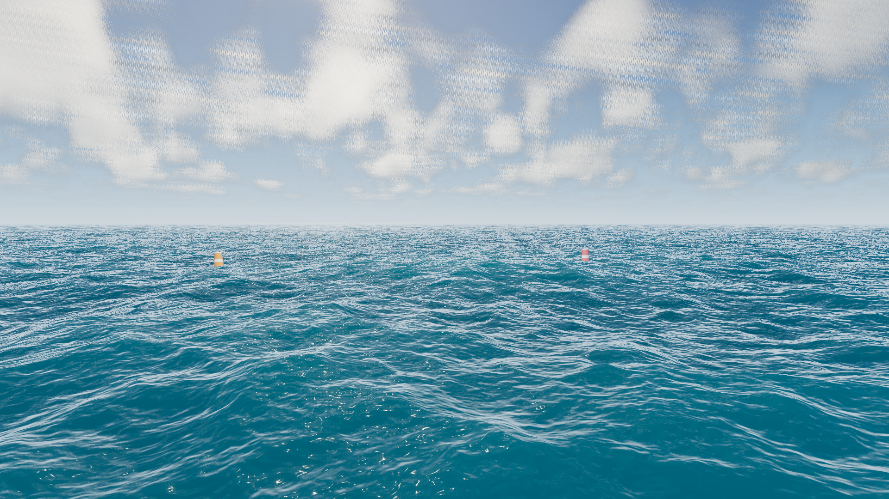

# Procedural Ocean — WebGPU

실시간 3D 해양 데모. Three.js `WebGPURenderer` + TSL로 작성했고, 외부 이미지·모델·HDRI 없이
모든 것을 절차적으로 생성한다.

```bash
node serve.mjs        # → http://localhost:8173
```

WebGPU를 우선 사용하고, 사용할 수 없으면 같은 코드베이스가 WebGL 2 백엔드로 자동 전환한다.
`?forcewebgl=1`로 폴백을 강제할 수 있다.



## 무엇이 들어 있나

- **파도 (스펙트럼)** — JONSWAP 스펙트럼을 WebGPU compute IFFT로 역변환하는 3 캐스케이드
  (L = 512 / 96 / 18 m). 복소 변환 하나에 실수 필드 두 개를 패킹해 실수 출력 6개를 변환
  3개로 처리한다. 정점은 변위를, 프래그먼트는 경사 텍스처를 다시 샘플해 메시가 담지 못하는
  디테일을 픽셀 단위로 복원한다.
- **파도 (Gerstner)** — compute가 없는 WebGL 2 폴백과 Low 티어의 엔진. 20성분 3밴드,
  심해 분산관계 `ω = √(gk)`, 해석적 법선과 Jacobian. 접힘 조건이 `Σk·H = choppy ≤ 1`로
  붕괴해 어떤 파고에서도 정점 뒤집힘이 구조적으로 불가능하다.
- **수면 기하** — 카메라 중심 방사형 단일 메시(High 384링 × 448섹터, 반경 60 km).
  연속 메시라 LOD 균열이 원천적으로 발생할 수 없고, 메시 끝은 헤이즈에 묻힌다.
- **광학** — Schlick Fresnel, 채널별 Beer–Lambert 흡수, 상향 산란광,
  Cox–Munk 해면 경사 분포에서 유도한 GGX 글리터, 역광 파도 정상 투과.
- **하늘** — 하나의 TSL 함수를 하늘돔·수면 반사·대기 원근이 공유한다. 큐브맵이 없으므로
  반사된 태양이 실제 태양과 어긋날 수 없고, 수평선은 구조적으로 연속이다.
  하늘돔은 1500–4200 m 슬래브를 레이마치해 입체 적운을 만든다(단일 산란 + HG 위상).
- **포말** — Jacobian 압축(스펙트럼 경로에서는 수평 발산) 기반 crest 마스크를 2스케일
  노이즈로 침식하고, 256 m 창의 ping-pong 히스토리에 감쇠·풍하 이류로 누적한다.
- **수중** — 실제 파고 기준 위/아래 판정(히스테리시스), 채널별 흡수와 산란,
  스넬 창, 절차적 해저 + 카우스틱, 부유 입자.
- **블룸** — 1/4 해상도 브라이트 패스 + 분리형 9탭 가우시안. 태양 글리터가 표시 범위를
  실제로 넘기는 유일한 요소라, 이웃 픽셀로 번져야 "흰색"이 아니라 "밝음"으로 읽힌다.
- **부표 9개** — 스케일 기준물. 수면과 **같은 캐스케이드 텍스처를 자기 정점 셰이더에서**
  샘플하므로 구성상 수면 위에 정확히 놓인다. 리드백도, 어긋날 시뮬레이션도 없다.
- **프리셋 5종** — Calm Lagoon / Open Sea / Golden Hour / Storm Front / Moonlit.
  색 필터가 아니라 태양·하늘·파도·물성·포말·수중까지 포함한 환경 상태 전체가 1.5초에 걸쳐 보간된다.

## 조작

| | |
|---|---|
| 드래그 | 시선 |
| `W` `A` `S` `D` | 이동 |
| `Q` / `E` | 하강 / 상승 |
| 휠 | 이동 속도 |
| `Shift` | 부스트 |
| `H` | 패널 · `P` 일시정지 · `R` 카메라 초기화 · `F` 성능 표시 |
| `1`–`5` | 프리셋 |

수면 아래로 내려가면 수중 표현으로 전환된다.

## 구조

```
index.html              진입점: importmap, 오버레이, 라이선스 고지
serve.mjs               정적 서버 (+ QA 캡처 저장 엔드포인트)
tools/qa.mjs            실 Chrome을 CDP로 구동하는 QA 하네스
vendor/three-0.185.1/   three r185 배포 4파일 (무수정, MIT)
src/
  main.js               부트스트랩 · 프레임 루프 · 품질 · 오류 처리
  core/                 유틸 · 렌더러 초기화 · 계측과 QA 훅
  env/                  상태 단일 소스 · 절차적 하늘 · 프리셋
  ocean/                파동 · 지오메트리 · 셰이딩 헬퍼 · 물 재질 · 포말 히스토리
  underwater/           수중 포스트 패스 · 해저 · 입자
  input/                fly 카메라
  ui/                   설정 패널 · HUD
qa/                     검수 스크린샷과 측정 리포트
```

빌드 단계가 없다. 브라우저가 `src/`의 파일을 그대로 로드하므로 산출물과 소스가 어긋날 수 없다.

## QA

```bash
node tools/qa.mjs smoke        # 부팅 + 콘솔 오류 확인
node tools/qa.mjs shots        # 프리셋·수중·폴백 캡처 9종
node tools/qa.mjs perf 30      # 실측 FPS / 프레임 타임 / 1% low
node tools/qa.mjs stress       # 리사이즈 · 프리셋 전환 · 수면 왕복 · 숨김 탭
node tools/qa.mjs soak 5       # 5분 메모리 안정성
node tools/qa.mjs eval '...'   # 실 브라우저 일회성 진단
```

성능과 애니메이션 판정은 반드시 이 하네스로 한다. 임베디드 브라우저는 페이지를
`visibilityState: "hidden"`으로 보고해 `requestAnimationFrame`이 아예 돌지 않는다.
자세한 이유는 `research.md` §8.

## 측정 결과 (2026-07-31)

HeadlessChrome 151 · macOS 26.5.2 · Apple M5 10-core GPU · WebGPU 백엔드

| 조건 | 평균 FPS | 프레임 | 1% low |
|---|---:|---:|---:|
| 1920×1080 High | 60.0 | 16.67 ms | 56.8 |
| 1280×720 High | 60.0 | 16.67 ms | 56.8 |
| 1920×1080 High / Storm | 58.3 | 17.14 ms | 30.0 |
| 1920×1080 High / 수중 | 60.0 | 16.67 ms | 56.8 |
| 3840×2160 Ultra (여유 측정) | 16.3 | 61.29 ms | 15.0 |

출하 설정에서는 60 fps(vsync 상한)이지만 Storm은 58.3으로 근소하게 못 미치고,
4K Ultra는 레이마칭 구름 때문에 무겁다. 자동 품질이 해상도를 낮춰 흡수한다.

## 독립 구현과 라이선스

이 데모는 공개된 렌더링 원리만으로 처음부터 작성했다. 상용 해양 데모 제품의 코드·셰이더·
텍스처·모델·설정값·브랜드·UI 배치를 사용하지 않았다.

유일한 서드파티는 **Three.js r185 (MIT)** 이며 `vendor/three-0.185.1/`에 무수정으로 포함하고
원문 라이선스를 함께 둔다. 출처와 근거는 `research.md`, 구현 기록은 `log.md`를 참조.
